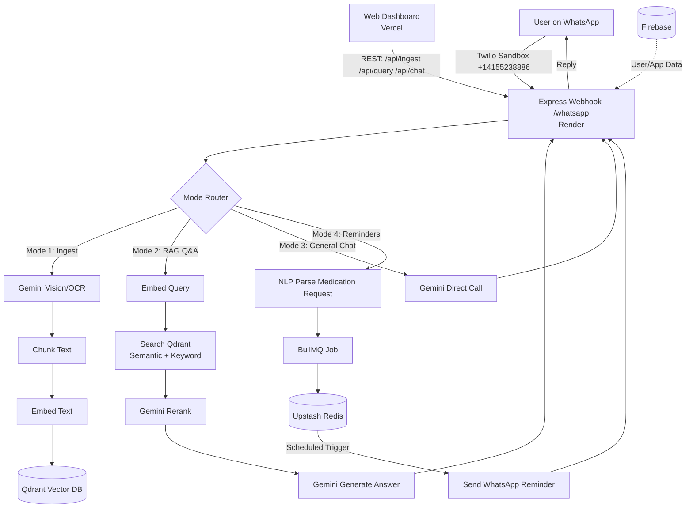
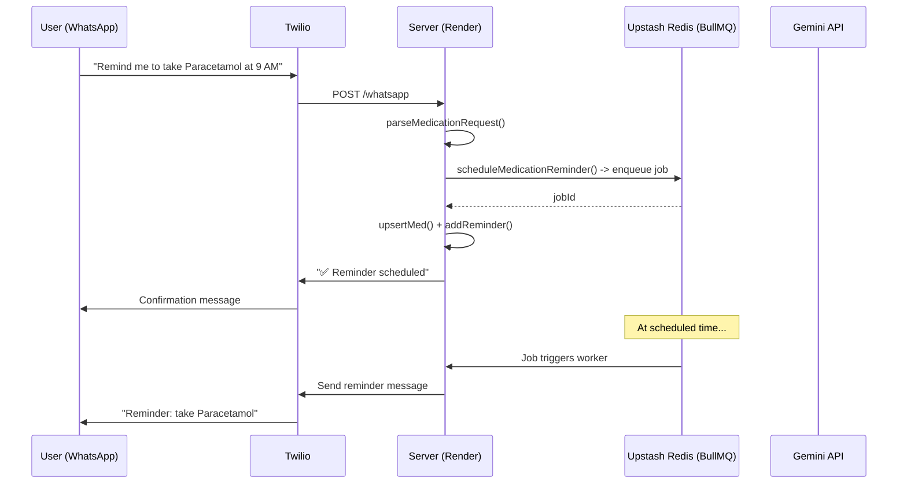
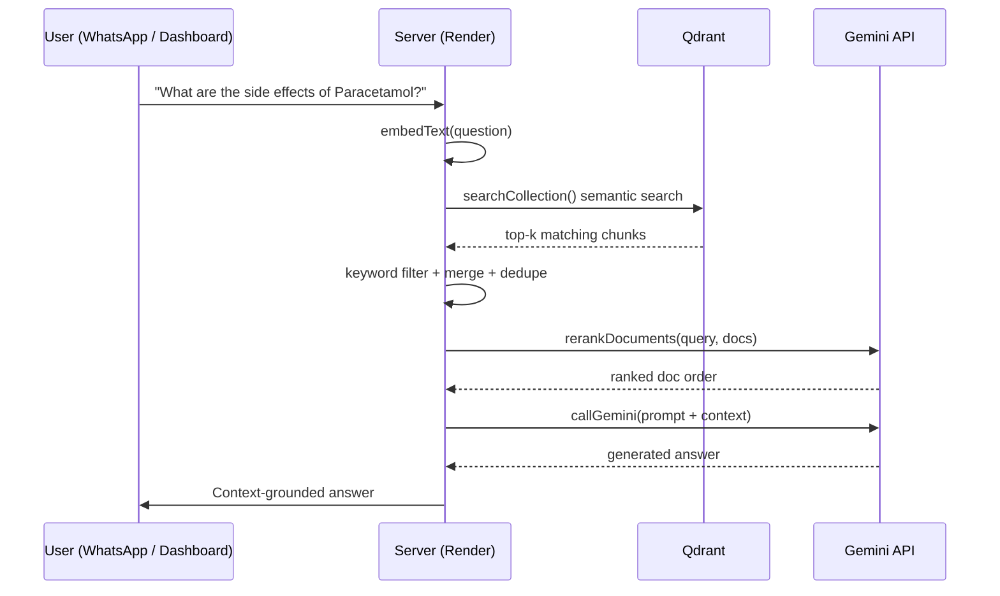
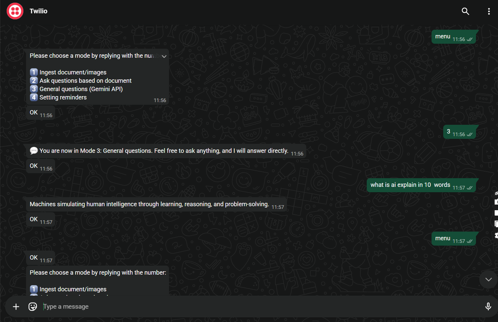
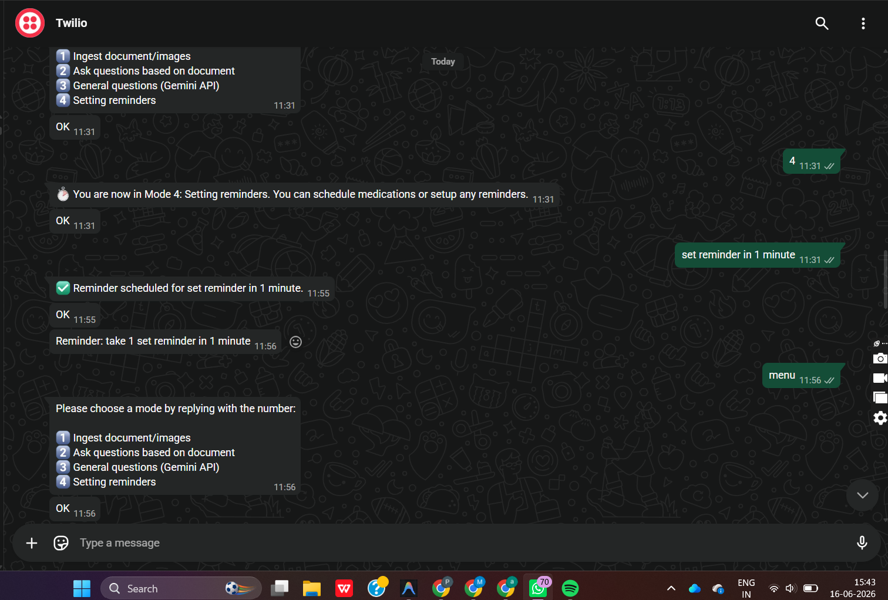

# WhatsApp AI Assistant (RAG + Reminders)

A WhatsApp-based AI assistant that combines medication reminders with Retrieval-Augmented Generation (RAG) for health Q&A. Users can schedule, list, and cancel reminders via WhatsApp while asking health-related questions answered from a medical knowledge base.

**🔗 Live Demo**
- Frontend (Dashboard): [whatsapp-ai-extended-version.vercel.app](https://whatsapp-ai-extended-version.vercel.app/)(currently expanding)
- Backend (API): [whatsapp-ai-extended-version-2.onrender.com](https://whatsapp-ai-extended-version-2.onrender.com)
- WhatsApp Sandbox Number: `whatsapp:+14155238886` (Twilio Sandbox)

## 🚀 Features

### Medication Reminders
- Schedule reminders using natural language (e.g., "Remind me to study at 5 pm ")
- List all scheduled reminders with IDs
- Cancel reminders by ID
- Automatic per-user persistence of reminders
- Powered by **BullMQ** + **Upstash Redis** for reliable, distributed job scheduling

### Health Q&A (RAG)
- Ask general health questions via WhatsApp
- Hybrid retrieval (semantic + keyword) against a **Qdrant** vector store
- Gemini-based reranking of retrieved context for relevance
- Google Gemini generates context-aware answers

### Document Ingestion
- Ingest raw text or upload images/documents directly via WhatsApp
- Gemini Vision/OCR extracts text from images/files
- Automatic chunking and embedding into Qdrant

### Modes (via WhatsApp)
1. **Ingest** documents/images
2. **Ask** questions based on ingested documents
3. **General** questions (direct Gemini)
4. **Reminders** — schedule, list, cancel

### Web Dashboard (Frontend)
- Hosted on **Vercel** as a Twilio-free alternative for ingesting documents, querying, and chatting
- Talks to the backend via the `/api/*` REST endpoints

### Usage Limits & Opt-Out
- Free tier capped at 10 messages per user
- Unsubscribe from all reminders with `stop reminders` / `unsubscribe`

## 🛠 Architecture / Flow



### Request Lifecycle (Reminder Example)



### Request Lifecycle (RAG Q&A Example)



## 🧰 Technologies Used

| Layer | Technology |
|---|---|
| Backend | Node.js, Express (deployed on **Render**) |
| Frontend | Web dashboard on **Vercel** |
| Database | **Firebase** (user/app data) |
| Messaging | Twilio WhatsApp API (Sandbox: `whatsapp:+14155238886`) |
| AI / RAG | Google Gemini, `@google/genai` |
| Vector DB | **Qdrant** |
| Job Queue / Scheduler | BullMQ + **Upstash Redis** |
| Env Management | dotenv |
| Tunneling (local dev) | Cloudflare Tunnel (optional) |

## ⚡ Setup (Local Development)

### 1. Clone the repository
```bash
git clone <repo-url>
cd gemini-rag-whatsapp
```

### 2. Install dependencies
```bash
npm install
```

### 3. Configure `.env` (Backend)
```env
PORT=3000
TWILIO_ACCOUNT_SID=<your_twilio_sid>
TWILIO_AUTH_TOKEN=<your_twilio_auth_token>
TWILIO_WHATSAPP_NUMBER=whatsapp:+14155238886

GEMINI_API_KEY=<your_gemini_api_key>
GEMINI_EMBEDDING_MODEL=<embedding_model_name>
GEMINI_LLM_MODEL=<llm_model_name>

QDRANT_API_KEY=<your_qdrant_api_key>
QDRANT_URL=<your_qdrant_cluster_url>

UPSTASH_REDIS_REST_URL=<your_upstash_redis_rest_url>
UPSTASH_REDIS_REST_TOKEN=<your_upstash_redis_rest_token>

FIREBASE_API_KEY=<your_firebase_api_key>
FIREBASE_PROJECT_ID=<your_firebase_project_id>

BASE_URL=https://whatsapp-ai-extended-version-2.onrender.com
MOCK_WHATSAPP=false
GOOGLE_APPLICATION_CREDENTIALS=
```

> ⚠️ Never commit `.env` to version control. Set these as environment variables/secrets in your Render dashboard for production, and in Vercel's project settings for the frontend.

### 4. Start the backend (local dev)
```bash
node --env-file=.env index.js
```

### 5. (Optional) Expose localhost for WhatsApp webhook testing
```bash
cloudflared tunnel --url http://localhost:3000
```
Use the generated URL as your Twilio WhatsApp webhook (`https://<tunnel-url>/whatsapp`).

## 🌐 Deployment

### Backend — Render
- Live at: `https://whatsapp-ai-extended-version-2.onrender.com`
1. Push repo to GitHub
2. Create a new **Web Service** on Render, connect the repo
3. Add all environment variables from `.env` above in Render's dashboard
4. Set the Twilio WhatsApp Sandbox webhook to `https://whatsapp-ai-extended-version-2.onrender.com/whatsapp`

### Frontend — Vercel
- Live at: `https://whatsapp-ai-extended-version.vercel.app`
```bash
cd frontend
npm install
vercel --prod
```
- Configure the frontend's API base URL env var to point to the Render backend (`https://whatsapp-ai-extended-version-2.onrender.com`)
- Add Firebase config values (apiKey, authDomain, projectId, etc.) as Vercel environment variables, not hardcoded in source

### Vector DB — Qdrant
- Create a cluster on [Qdrant Cloud](https://cloud.qdrant.io)
- Copy the cluster URL and API key into `QDRANT_URL` and `QDRANT_API_KEY`

### Redis — Upstash
- Create a Redis database on [Upstash](https://upstash.com)
- Use the REST URL and token (`UPSTASH_REDIS_REST_URL`, `UPSTASH_REDIS_REST_TOKEN`) for BullMQ's Upstash-compatible connection

### WhatsApp — Twilio Sandbox
- Sandbox number: `whatsapp:+14155238886`
- Join the sandbox by sending the join code (from your Twilio console) to that number from your personal WhatsApp
- Set the sandbox "When a message comes in" webhook to the Render `/whatsapp` URL

## 📡 API Endpoints (Web Dashboard)

| Method | Endpoint | Description |
|---|---|---|
| GET | `/api/health` | Health check |
| POST | `/api/ingest` | Ingest raw text into the vector DB |
| POST | `/api/query` | Ask a question against ingested documents (RAG) |
| POST | `/api/chat` | General chat (no retrieval) |
| POST | `/whatsapp` | Twilio WhatsApp webhook |

## 💻 Usage & Screenshots

### 1. Whatsapp Screenshots:
## 📸 Demo

<p align="center">
  
  
</p>


### 2. Web Dashboard
Live at [whatsapp-ai-extended-version.vercel.app](https://whatsapp-ai-extended-version.vercel.app/)


## 🌟 Highlights

- **RAG-Powered**: Reduces hallucinations by combining vector search with generative AI
- **Reliable Scheduling**: BullMQ + Upstash Redis ensures reminders persist and fire even across restarts/serverless cold starts
- **Real-Time Reminders**: Natural language scheduling via WhatsApp
- **Cloud-Native Stack**: Qdrant, Upstash, Firebase, Render, and Vercel remove the need to self-host infra
- **Extensible**: Add more medical documents or swap AI models easily
- **Quick Setup**: Cloudflare tunnel for local testing without deployment

## 📝 WhatsApp Commands Reference

| Command | Description |
|---|---|
| `menu` / `mode` | Return to mode selection |
| `1` / `2` / `3` / `4` | Select a mode |
| `list reminders` | Show all scheduled reminders with IDs |
| `cancel reminder <id>` | Cancel a specific reminder |
| `stop reminders` / `unsubscribe` | Cancel and remove all reminders |

## ⚠️ Notes

- The Render free tier may spin down on inactivity; the first message after idle time can be slow while the service cold-starts.
- Twilio Sandbox numbers require users to "join" via a code before they can message the bot; this is a sandbox limitation, not present with a verified production WhatsApp Business number.
